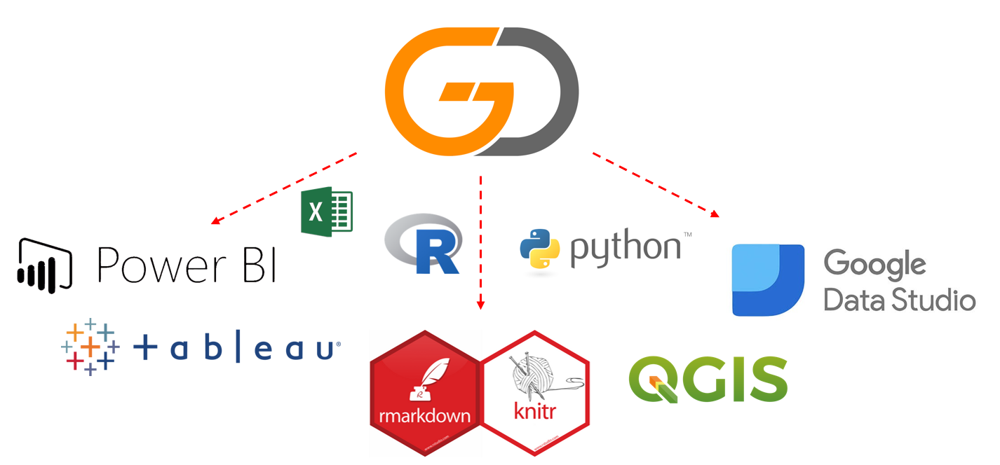

# Go.Data Analytics Add-Ons & Dashboards

## sub heading here

### sub heading 2 here

Although there is quite a bit of native analytics funcitonalities within the Go.Data web-app, we provide here additional resources if you would like to export you data to another platform for more customized dashboards or advanced analysis. 

If your analytics tool does not exist here we welcome you to add the documentation and code to this repo for others to benefit. Please see our [Contribution Template](https://github.com/WorldHealthOrganization/godata/blob/master/docs/contribute/contribution-template.md) to submit a your use case!

