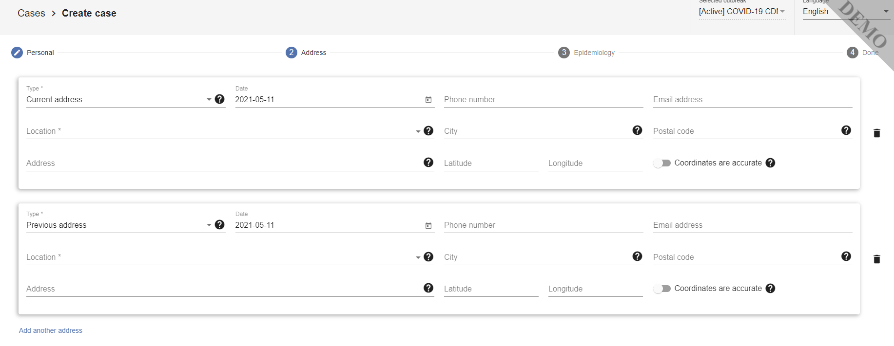

# Getting to know your Data
Before beginning data collection and in order to consider any analytics and interoperability solutions, you should get to know the metadata requirements within the Go.Data, including understanding what is defined vs. what you can configure on your own. We recommend keeping up-to-date technical documentation for your deployment such as a Data Dictionary, which we describe below.

## [Go.Data Data Dictionary](https://docs.google.com/spreadsheets/d/1gt1JZaUXLmacbMJ1SvHBAA0P_TWGA5e8ZDKvzq3kg3Q/edit?usp=sharing)
-At the link above, you can view a dictionary of Go.Data metadata elements.
**NOTE:  You will need to adapt this data dictionary to fit what you have configured in your system beyond core module's metadata. this would include any new variables added for custom forms across cases, contacts, follow-ups and labs. In addition, you can modify option sets for categorical variables as needed.**

## Metadata overview 
Please see below sections for some important points regarding Go.Data metadata. You can also refer to the [Metadata Overview Guide](https://sprcdn-assets.sprinklr.com/1652/69a1e048-e8b7-47ea-8e90-512a50600ecd-1206687439.pdf) You can find tables of the _required metadata fields_ below. Please refer to document to see the entire list.

### Case/Contact Required Variables
When creating a new person (case, contact or contact of contact), you are prompted to fill out 3 main sections - **Personal**, **Address**, and **Epidemiology**. 

Within these tabs you have a range of pre-formatted core variables to fill in - some required, some optional. The table below highlights the required fields.

Variable Label     | Code                | Definition        |  Source / Notes
------------------|---------------------|-------------------|-------------------- 
**Case/Contact ID** | visualId | Visual Unique Identifier for any entity (Case, Contact, Contact of Contact) created in the system | Pre-filled according to pattern set in Outbreak settings. Read more info on unique IDs and cask masks [here](). This is NOT the same as the uuid generated automatically but we recommend you have a read-able Visual ID system across all cases and contacts.
**First Name** | firstName | First Name of person or event | Freetext. Additional fields for Middle and Last Name exist but are optional. If you do not want to put the actual first name, you can also put an ID here (for instance, Country Identifier or Passport Number). 
**Date of Reporting** | dateOfReporting | Date (YYYY-MM-DD) that record is filled | Date selector from calendar.
**Location** | locationId | Location (Recommended to fill most granular Admin Level) | Configurable Go.Data Reference Data (choose from location hierarchy, after your locations have been configured). This automatically stores all parent locations to the case/contact record, as well as associated GPS coordinates.
**Classification** | classification | Classification of case | Configurable Go.Data Reference Data (Default values include "Confirmed", "Probable", "Suspect", "Not A Case-Discarded"
**Date of Onset** | dateOfOnset | Date of symptom onset | Date selector from calendar. NOTE: You can set in outbreak settings for this field to be not required (as may be desirable for COVID-19 with many asymptomatic cases).
**Date of Last Contact** | dateOfLastContact | Date of last contact with the confirmed or probable COVID-19 case | Date selector from calendar. NOTE: This will be used in generating Follow Up period, as Day 0, for 1st Follow Up to occur on Day 1. _If desirable, can set 1st Follow Up for Day 0 by checking "Start contact follow-up on the date of last contact" in outbreak settings._

### Event Required Variables
When creating an event, you are prompted to fill out 2 main sections - **Details** and **Address**.

Within these tabs you have a range of pre-formatted core variables to fill in - some required, some optional. The table below highlights the required fields.

Variable Label     | Code                | Definition        |  Source / Notes
------------------|---------------------|-------------------|-------------------- 
**Event Name** | name | Event name | Freetext
**Date of Reporting** | dateOfReporting | Date (YYYY-MM-DD) that record is filled | Date selector from calendar.
**Date** | date | Date (YYYY-MM-DD) that event occurred | Date selector from calendar.
**Location** | locationId | Event Location (Recommended to fill most granular Admin Level) | same notes as above apply.

### Lab Required Variables
When creating an lab sample, you are prompted to fill out only 1 main section - **Details**. You can add as many lab results for any given person, over time. The records are _per sample_ not _per person_.
**NOTE**: From the web-app, you can only create a lab sample for an existing registered person (case, contact or contact of contact). If bulk importing, you must indicate existing **Person ID** with the proper pattern. A **Sample ID** is not required but is an optional field.

Within this tab you have a range of pre-formatted core variables to fill in - some required, some optional. The table below highlights the required fields.

Variable Label     | Code                | Definition        |  Source / Notes
------------------|---------------------|-------------------|-------------------- 
**Person ID** | visualId | Visual Unique Identifier for any entity (Case, Contact, Contact of Contact) created in the system | This is already stored if you are adding lab-result in web-app. If bulk importing lab results, you must add a column for "Person ID".
**Date Sample Taken** | dateSampleTaken | Date (YYYY-MM-DD) that lab sample was taken | Date selector from calendar.

### Location/GIS Variables
The below variables are stored within the `addresses` block of .json, when registering cases, contacts or events. Please note that some are from reference data that must be configured, while others are freetext. **Indicates Required Field**

Variable Label     | Code                | Definition        |  Source / Notes
------------------|---------------------|-------------------|-------------------- 
**Location** | locationId | Location (Recommended to fill most granular Admin Level) | Configurable Go.Data Reference Data (choose from location hierarchy, after your locations have been configured)
Latitude | lat | Latitude |  Configurable Go.Data Reference Data OR manual capture depending on location chosen from drop-down
Longitude | lng | Longitude | Manual Capture OR taken from Go.Data Reference Data depending on location chosen from drop-down
Coordinates Accurate | geoLocationAccurate | GPS Coordinates are considered precise | Toggle to mark Yes or No
City | city | City | freetext
Street | addressLine1 | Street | freetext
Phone Number | phoneNumber | City | freetext
Postal Code | postalCode | Postal Code | freetext
Email address | emailAddress| Email Address | freetext
**Address type** | typeId | Type of address | Defaults to _Current address_ unless _Previous address_ is selected. Can add additional address types in configurable reference data. (Reference Data Default Values: Current Address, Previous Address, Other)

The Go.Data address variables can be found in the "Address" Block when going to register a case, contact or event, as seen in screenshot below. You can add as many addresses as you want for an entity. The address marked as `type` = `current` will be that which is used in analytics dashboards within the application. 

