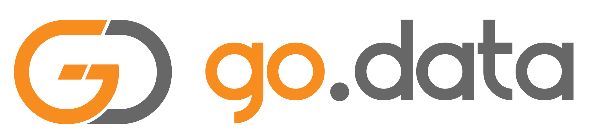
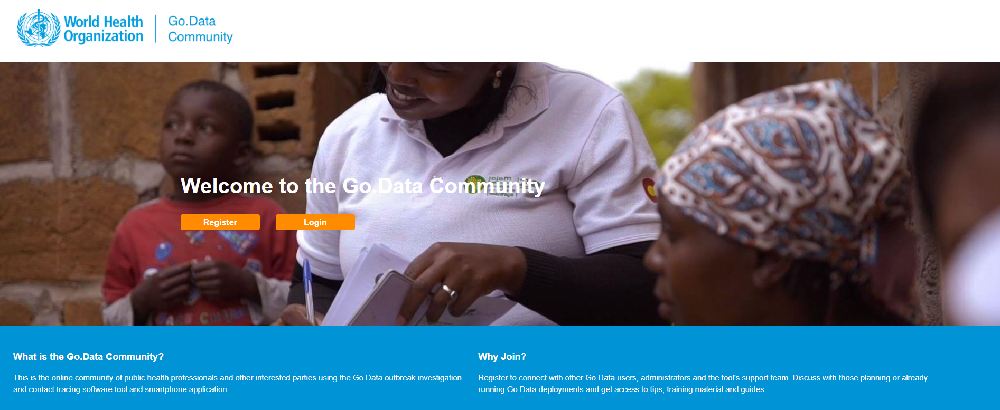

---
# Feel free to add content and custom Front Matter to this file.
# To modify the layout, see https://jekyllrb.com/docs/themes/#overriding-theme-defaults
title: Home
layout: home
nav_order: 1
---

# Welcome to the Go.Data documentation site!
This is linked to the public WHO Go.Data Github repository: [https://github.com/WorldHealthOrganization/godata](https://github.com/WorldHealthOrganization/godata)

You can find a collection of all other forked repositories related to the Go.Data project [here.](https://github.com/WorldHealthOrganization?q=go-data&type=&language=)

## About Go.Data
[Go.Data](https://www.who.int/godata) is an outbreak investigation tool for public health emergencies, and includes features for contact tracing, contact follow-up, and visualizing chains of transmission. Go.Data is designed to specifically support outbreak responders and intended to be implemented alongside other systems for health surveillance, information management, and service delivery. 

## Aim of this documentation site
This site is a centralized place where you can access _technical documentation and code_ that you may find useful in your Go.Data deployment. This includes code snippets and documentation to access the Go.Data API, perform data exchange / integration with other systems, and conduct additional analysis with a range of software tools. 

Any generic information about Go.Data is best accessed through our [Community of Practice website](https://community-godata.who.int/) (https://community-godata.who.int/), where we link to a range of user guides and training materials. You can dialogue there with the community of Go.Data users on a number of discussion forums. You can access our open-access online training course across multiple languages through OpenWHO [here](https://openwho.org/courses/godata-en).

### Engaging the open-source community
Go.Data development and implementation is centered around a collaborative approach, and we prioritze ongoing engagement with the vast open-source commnity of developers, ICT4D professionals, epidemiologists, and more. One way is through openly sharing Interoperability & Analytics use-cases and documentation to this Github site and welcoming users' developments in this area. To learn more on how the Go.Data team and wider WHO is using the Github platform to engage the open-source community, feel free to check our [Panel Session at Github Universe 2020!](https://www.youtube.com/watch?v=clm5Ee6O_4o)

## Go.Data Demo Instance
If you would like to try Go.Data before downloading and installing yourself then a “sandbox” environment has been made available on a WHO server.  This is a play instance of the latest version of the software and you are free to create an outbreak, populate it with data, experiment with reports, exporting data etc.  You can make any changes that you like to explore the tool and see it in practice and an outbreak with dummy data has been provided to give you a head start.
  - This environment resets every two days however, so should not be used for building demonstrations or for any work that you would like to persist.  Also bear in mind that others may be using the environment at the same time as you
  - To request your login account please complete the form below/send an email to [godata@who.int](mailto://godata@who.int) including:
  1. The name of your institution and the country where you are working
  2. Your intended use of Go.Data
  3. Your preferred duration for using the demo site

## Questions & Contributions
We are actively seeking feedback and contributions from the community. Please report any bugs, suggestions or feature requests as new issues [here](https://github.com/WorldHealthOrganization/godata/issues), clearly stating topic in the subject title and tagging with appropriate labels. You can also submit a pull request directly to the repository (first email [godata@who.int](mailto://godata@who.int) to be added as a collaborator).

To contribute this documentation site & submit projects and code samples, summarize your project by drafting a new `Project` page and submitting to the Go.Data repo as a pull request. See the `Contribution Template`: [https://github.com/WorldHealthOrganization/godata/blob/master/docs/contribute/contribution-template.md](https://github.com/WorldHealthOrganization/godata/blob/master/docs/contribute/contribution-template.md)
