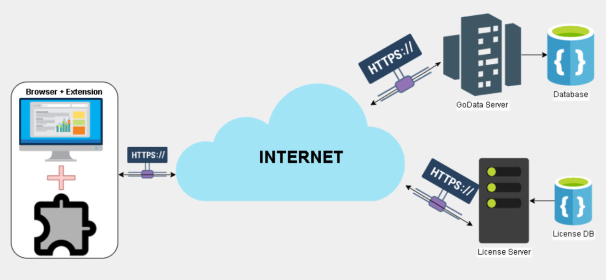
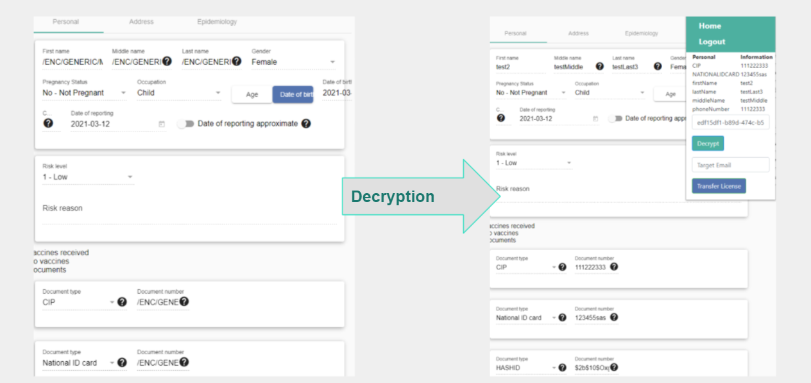

# Live Integrations and Extensions for Go.Data

There are a number of solutions that have been built by Go.Data users to add on to existing functionality or to link to other systems. You can find the full list of related repositories connected to the Go.Data tool in the overarching WHO Github Repository by filtering for topics = "go-data", as seen [here](https://github.com/WorldHealthOrganization?q=go-data&type=&language=) Below we list some examples of technical solutions that have been built. 

_To engage directly with this community, visit the "Interoperability" forum in the CoP [here](https://community-godata.who.int/topics/interoperability/5fd8ec64f5c77e114e6c6823)_

## [Go.Data-DHIS2 Interoperability App](https://www.notion.so/Go-Data-DHIS2-Interoperability-App-3a12d174c9f34d64bc2a6bbe1ea9784d)

Collaborators at the Polytechnic University of Catalonia (UPC) have developed a DHIS2 app for exporting metadata and data between DHIS2 and Go.Data. This has been a common request for countries who are using DHIS2 COVID-19 package for case registration but would like to utilize Go.Data for contact tracing follow-up. See instructions on how to install and for more detailed documentation [here](https://www.notion.so/Go-Data-DHIS2-Interoperability-App-3a12d174c9f34d64bc2a6bbe1ea9784d). 

For questions / considerations on if this can be piloted in your setting and to provide feedback, please view [this post](https://community-godata.who.int/conversations/interoperability/call-of-interest-piloting-godatadhis2-interoperability-app/6012b391dbaa4b35ec1837cd) on the Go.Data Community of Practice.

See Github directories: 
-[dhis2-godata-interoperability](https://github.com/WorldHealthOrganization/dhis2-godata-interoperability)
-[godata-api-wrapper](https://github.com/WorldHealthOrganization/godata-api-wrapper)

## [DHIS2 to Go.Data Metadata Sync](https://worldhealthorganization.github.io/metadata-synchronization-blessed/metadatasync/)
Collaborators at [EyeSeeTea](https://github.com/EyeSeeTea) have developed 
- a DHIS2 Application ***Metadata Sync*** allowing for flexible export of DHIS2 Metadata
- a script to quickly convert dhis2 Organization Units to Go.Data locations.

See Github directories:
-[metadata-synchronization](https://github.com/EyeSeeTea/metadata-synchronization-blessed)
-[dhis2godata](https://github.com/WorldHealthOrganization/WIDP-DHIS2-scripts/tree/master/dhis2godata)

## [Go.Data Anonymization Extenstion](https://github.com/WorldHealthOrganization/InSSIDE)

Collaborators at the Polytechnic University of Catalonia (UPC) have developed an extension to enable secure exchange of anonymized case data across institutions, such as hospitals. When a user connects to GoData if he/she has the data anonymization extension installed, it communicate via internet to a seperate License Server based on Digital Rights Managemetn (DRM) techniques.

For questions / considerations on if this can be piloted in your setting and to provide feedback, please view [this post](https://community-godata.who.int/conversations/interoperability/godata-anonymization-browser-extension-for-secure-data-exchange-across-hospitalsinstitutions/60ae1c3b4a5ae60c2e29a844) on the Go.Data Community of Practice.

See Github directory: [InSSIDE](https://github.com/WorldHealthOrganization/InSSIDE)
See Presentation walkthrough [here](https://github.com/WorldHealthOrganization/godata/blob/master/docs/integration/GoData%20Anonymization%20-%20Final%20Presentation%202021%20May.pdf)

## WHO Polio Geo-Database to Go.Data

Collaborators at [EyeSeeTea](https://github.com/EyeSeeTea) have developed a script to quickly convert admin levels from the WHO Polio GeoDatabase to Go.Data locations.

See Github directory:[PolioDB-GODATA](https://github.com/EyeSeeTea/WIDP-scripts/tree/master/PolioDB-GODATA)

## OpenFn Job Scripts for API Actions
[OpenFn](https://www.openfn.org/) has developed a number of automated interoperability solutions to demonstrate common Go.Data interoperability use cases and examples [OpenFn job scripts](https://docs.openfn.org/documentation.html#jobs) 
These serve to automate common API and data exchange operations and leverage OpenFn open-source API adaptors including [`language-godata`](https://github.com/WorldHealthOrganization/language-godata/).

See Github directory: [interoperability-jobs](https://github.com/WorldHealthOrganization/godata/tree/master/interoperability-jobs)

## Other Scripts for API Actions
See Github directory: [api](https://github.com/WorldHealthOrganization/godata/tree/master/api) and [Analytics documentation](https://worldhealthorganization.github.io/godata/analytics/).

This contains example R, Python and C# scripts for GET/PUT/POST commands so that you can manipulate your Go.Data instance through the API, including bulk actions. We have used this for our training instances but think it could be helpful for others too.

## Lime Survey to Go.Data
Coming soon
{: .label .label-yellow }
A project developed internally by WHO Information Management and Technology Department to link Data Form (Lime Survey) to Go.Data API for the exchange of COVID-19 tracking data for WHO staff. This is a very specific solution internal to WHO's need but illustrates integrating the Lime Survey and Go.Data interfaces using .Net 4.7.2 - C# code. 
