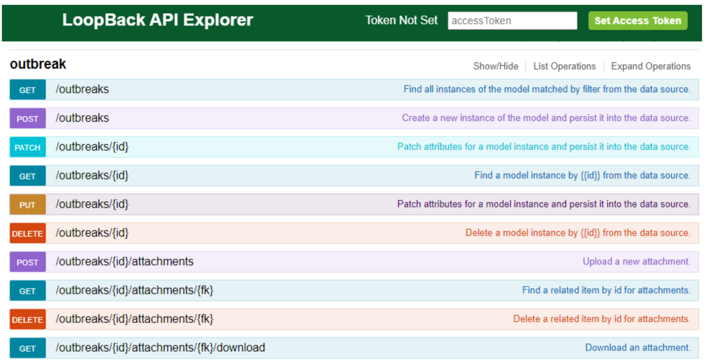
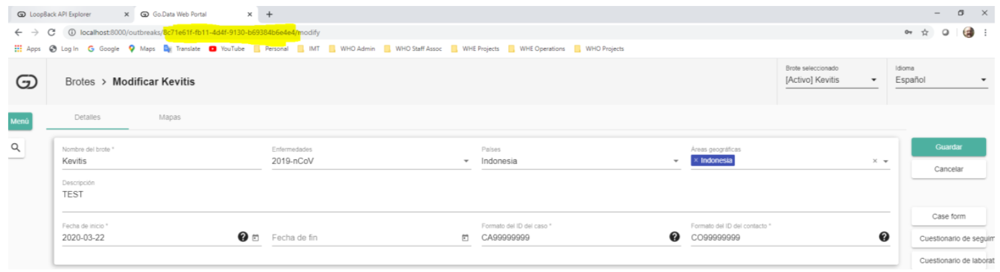

# Go.Data API Documentation
_This section was originally published in the Go.Data **IT Admin Guide, pg. 53**. Additional resources have been added_

## API Introduction
Go.Data exposes an Application Programming Interface (API) which is used for all interactions between the web front-end, the smartphone applications and even between copies of Go.Data, if you configure multiple instances of the solution to exchange data in an “upstream sever/client application” model.
This means that the API is very flexible and any operation possible from the web interface/smartphone can also be made by calling the appropriate method direct.

## API Explorer 
The self-documenting description of the API methods can be viewed using Loopback Explorer by adding `/explorer` to the end of any Go.Data URL.  For example, when installing Go.Data on your local machine with default settings: -
`http://localhost:8000/explorer`

Loopack explorer provides some examples of possible operations, lists interface parameters and allows you to manually input json inputs and to test them against the API.
Methods are present to `GET`, `POST`, `PATCH`, etc. for bidirectional exchange of data with Go.Data. A familiarity with the types of data entities present within Go.Data is essential for understanding the API.

See the API Loopback Explorer for the Go.Data Demo Site: *[INSERT URL]*

For more information on interacting with the API (e.g., how to add field filters to HTTP requests), see the LoopBack documentation: 
https://loopback.io/doc/en/lb3/Fields-filter.html

## Authentication 
Almost all methods exposed by Go.Data require the request to be called by an authenticateduser. Authentication works as follows: 
1. A call must be made to POST method /users/login passing in an email and password for a valid user within Go.Data. An example is given below:
```
{ 
"email": "email@test.com", 
"password": "your_password_here" 
} 
```
2. If the user details passed are accepted, then this method will return the following json response which contains an “id” property which 
is the authentication token to be used by this user for subsequent calls.
```
{ 
"id": "Iv0S7Tj1F8RJaQSpBPHUlQ518KOUmK3SC7FlDvqLgbfbtjBt6ZFB77ViEQnKtqRq",
"ttl": 600,
"created": "2020-06-22T13:20:49.549Z", 
"userId": "18bf64ac-a36e-4890-a074-64aec702e21b", 
"createdAt ": "2020-06-22T13:20:49.550Z",
"createdBy ": "system",
"updatedAt ": "2020-06-22T13:20:49.550Z",
"updatedBy ": "system",
"deleted": false
} 
```
3. The `token` received must be passed in the header of following calls. Within the loopback explorer interface, there is the 
option to enter this token at the top right and request that it is stored for testing further calls.


4. Note that all users in Go.Data have a *single “active” outbreak* and this will be the one whose data is returned in subsequent calls using the authentication token received for the user. 
If you need to work across multiple outbreaks in your code, then you will either need to change users OR switch the active outbreak of the current user via an API call.

5. For this same reason, following call to work with outbreak data usually involve methods under the “outbreak” API path as shown in the next screenshot.


6. Other tools such as SoapUI or even constructing a query and submitting directly as a URL are possible. For example, to retrieve a list of all outbreaks in Go.Data using an authentication 
token already received calling the API of my local instance, the call would be constructed as follows:
```
http://localhost:8000/api/outbreaks?
access_token=VUCA57YkMIcF5R2M8vl6PuaNHoMU0Q3Mr4cmGEOH06CPblx6xflnAw0AfQaMYdZP
```
Note that is the response returns `422 "Invalid captcha"` if received when attempting the call to the login API method, then this is a known issue linked to Go.Data’s use of cookies 
and you can workaround as follows:
1. Captcha is saved in a session variable associated with the cookie provided by the browser only for a specific web page. Make sure that you don’t call `'GET /captcha/generate-svg'` with `forComponent=login`. 
If you want to use the login directly from the API, avoid calling this method, since this is the method that forces the login method to restrict access without entering captcha. If this is the case, 
restart the API, followed by calling login without calling this method first.

2. f you use API Explorer requests, in which case the browser attaches the cookie used by the session variable, with one usage example being: open login page, followed by accessing the explorer and try to login, 
then you will get the `422 “Invalid captcha”` error, then these are the steps to follow:
- close all websites page, close browser
- open browser
- open explorer directly without going through the login page (in this case the
browser resets the cookie variable, so it should work without having to restart the API)

Other potential solutions:
- use browser with incognito mode
- use a different browser than the one used for Web UI
- close tab followed by clearing cookies cache related to this website

## Working with data 
Once authenticated, bidirectional exchange of data with Go.Data’s API is then possible, and the lifetime of the authentication token is extended with each successful call.

### Outbreak example
For example, to retrieve details of a single outbreak (the name of the outbreak, location etc.) a call can be made to the `GET` outbreaks method and would be constructed as follows by passing in both the access token (received from authentication) and the ID of the outbreak of interest.

```
GET /outbreaks
```
```
http://localhost:8000/api/outbreaks/8c71e61f-fb11-4d4f-9130-b69384b6e4e4?
access_token=VUCA57YkMIcF5R2M8vl6PuaNHoMU0Q3Mr4cmGEOH06CPblx6xflnAw0AfQaMYdZP
```

The IDs used in these calls are the internal Globally Unique Identifiers (GUIDs) used as primary keys for records in the MongoDB.
In the example above, there are two ways that a user could find the ID of the outbreak to use: 
1. If the user logins in Go.Data and navigates to a record, then the ID typically appears in the URL at the top of the page. An example is given below for viewing the example `Kevitis` outbreak and the ID that appears.
```
http://localhost:8000/api/outbreaks/8c71e61f-fb11-4d4f-9130-`b69384b6e4e4?
access_token=VUCA57YkMIcF5R2M8vl6PuaNHoMU0Q3Mr4cmGEOH06CPblx6xflnAw0AfQaMYdZ
```


2. If a user needs to look up an ID, then it can always be done via a method also. In this example, the GET outbreaks method can be used to retrieve all outbreaks and then find the ID of the one in which you’re interested.
```
GET /outbreaks
```
### Case example
As a second example, the call to retrieve all cases belonging to a given outbreak would be as follows:
```
GET /outbreaks/{id}/cases
```
```
http://localhost:8000/api/outbreaks/8c71e61f-fb11-4d4f-9130-b69384b6e4e4/cases?
access_token=VUCA57YkMIcF5R2M8vl6PuaNHoMU0Q3Mr4cmGEOH06CPblx6xflnAw0AfQaMYdZP
```
Note that any security restrictions that limit the data which the user can see will also apply to calls via the API. Users should be careful to authenticate with a user account which has sufficient privilege and access for the data they wish to access/change.
The call to access the record for a specific case would then incorporate the access token, the outbreak ID and the ID of the case you wish to return:
```
GET /outbreaks/{id}/cases/{fk}
```
```
http://localhost:8000/api/outbreaks/8c71e61f-fb11-4d4f-9130-b69384b6e4e4/cases/3cd71bf6-afac-40d3-a32d-a1793cfe7638
access_token=HNm29JYiCIa0sNk5kjyTl8FeGKJmhFMiWAhGL6FOBVcBSCc2s2JDQ3EnLH4dFt4l
```

For posting data back to Go.Data, the same json structures should be used but if there are any fields that are not to be changed, then those JSON properties should be omitted, not left blank.
For example, if we wished to update the first name for the Case that was retrieved in the previous call then a call would be made to the following PUT method:
```
PUT /outbreaks/{id}/cases/{fk}
```
And the data passed in would be only the field to be changed:
```
{ "firstName": "TestDemo" } 
```
This constructs the following call:
```
http://localhost:8000/api/outbreaks/8c71e61f-fb11-4d4f-9130-b69384b6e4e4/cases/3cd71bf6-afac-40d3-a32d-a1793cfe7638?access_token=HNm29JYiCIa0sNk5kjyTl8FeGKJmhFMiWAhGL6FOBVcBSCc2s2JDQ3EnLH4dFt4l
```
### Filtering example
To use the filters provided with the method calls, the syntax is to use the keyword “where” and the sequence of elements for filtering: `{"where":{"fieldname": "filtervalue"}}`

So for example, if filtering the method `GET /outbreak/{id}/cases` based on the Case ID, the filter would be `{"where":{"visualId": "CA00000001"}}`. This string will need URL encoding if passed as part of the URL. For more on filtering, see the Loopback docs: https://loopback.io/doc/en/lb3/Fields-filter.html

A full list of examples is given below.
- JSON QUERY:  `{"where":{"createdAt":{"$gt":"2020-04-14T00:00:00Z"}}}`
- URL ENCODED: 
`%7B%22where%22%3A%7B%22createdAt%22%3A%7B%22%24gt%22%3A%222020-04-14T00%3A00%3A00Z%22%7D%7D%7D`
- REQUEST COMMAND: 
`/outbreaks/{OUTBREAK TOKEN}/cases?filter=%7B%22where%22%3A%7B%22createdAt%22%3A%7B%22%24gt%22%3A%222020-04-14T00%3A00%3A00Z%22%7D%7D%7D&access_token={ACCESS TOKEN}`
- FINAL GET REQUEST: 
`https://godata.gov.mt/api//outbreaks/{OUTBREAK TOKEN}/cases?filter=%7B%22where%22%3A%7B%22createdAt%22%3A%7B%22%24gt%22%3A%222020-04-14T00%3A00%3A00Z%22%7D%7D%7D&access_token={ACCESS TOKEN}`

## Example Implementations
- See the [Github `api` directory](https://github.com/WorldHealthOrganization/godata/tree/master/api) for sample scripts leveraging the API. 
