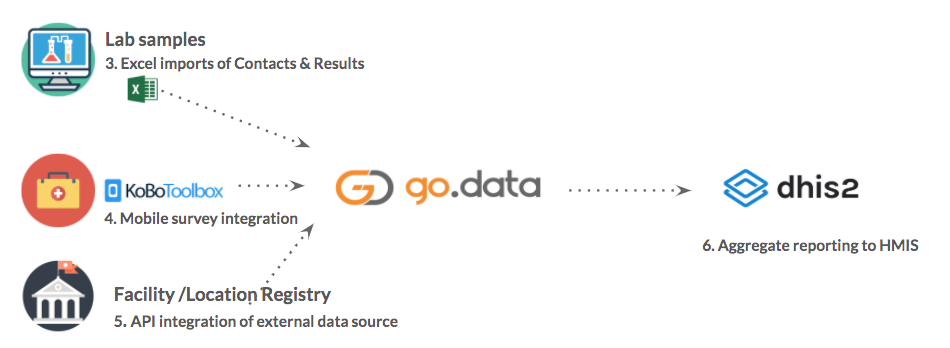

# Go.Data Interoperability Toolkit
This documentation and linked Github repository ([https://github.com/WorldHealthOrganization/godata](https://github.com/WorldHealthOrganization/godata)) provides a suite of resources to enable and strengthen the interoperability of Go.Data implementations with existing health information systems, data collection tools, and reporting mechanisms. Read on for tools, templates, & [real-world examples](https://github.com/WorldHealthOrganization/godata/interoperability-examples/) to help address your interoperability requirements.

