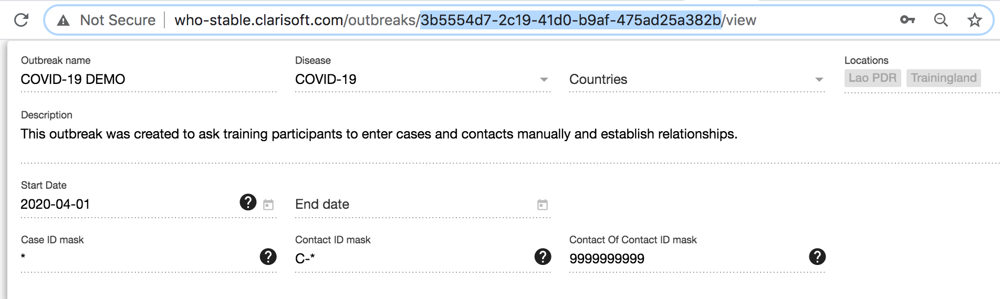
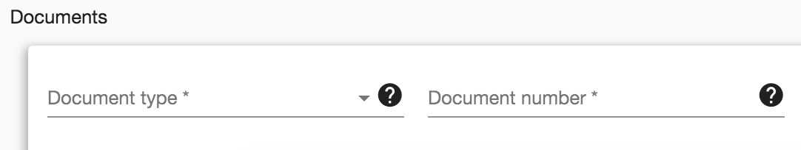

# Go.Data Unique Identifiers & Integration Considerations
## 1. Unique identifier schemes
When interoperating with other systems, determining unique identifiers for every shared resource is critical to developing shared records, preventing duplicates, and preserving data integrity. 

### Go.Data Global Record Ids (GUIDs)
All records created in Go.Data are assigned a system-generated internal Globally Unique Identifier (`id`). 
GUIDs (e.g., `8c71e61f-fb11-4d4f-9130-b69384b6e4e4`) are used as primary
keys for records in the MongoDB, and are **required to request and update Go.Data records** via the API.

`GET  /api/outbreaks/8c71e61f-fb11-4d4f-9130-b69384b6e4e4`
`POST  /api/outbreaks/8c71e61f-fb11-4d4f-9130-b69384b6e4e4/cases/3b5554d7-2c19-41d0-b9af-475ad25a382b`

On the front end, you can find this `id` in the URL of a record you are viewing...

### Case & Contact IDs
Users can also choose to define `ID mask` for `Cases` and `Contacts` to assign a human-readable identification pattern that Go.Data will use to
create a globally unique identifier to track each case. These IDs can be configured when first setting up an `Outbreak`. 

Mask ID naming conventions...
`0`: Digit (0 through 9)
`9`: Digit (auto-generated sequence number)
`Y`: Year (Using year from the dateOfReporting)
`@`: Letter (A through Z)
`&`: Any character including spaces
`*`: For any character with no limitations in ID length

Mask ID examples:
- `Case Mask ID: *` might be used if we wanted to import an external identifer for `case_id` with no limits on characters (e.g., `028391BX01`, `827JN09K11`)
- `Case Mask ID: CASE-99999` might be used if we wanted to auto-assign an autonumber `case_id` with a standard prefix (e.g., `CASE-00001`, `CASE-00002`)
- `Case Mask ID: @@@-000000000` might be used if we wanted to import `case_id` that included country code and national Id number (e.g., `SEN-021929192`)

**Note:** If interacting with this `Mask ID` via the API, this is variable is labeled as `visualId` in all the body of API responses. 

### 'Document' variable
On Case and Contact there is a standard `Document` variable available for users to specify other Document identification (e.g., national ID, passport). 

### Questionnaire custom variables
Questionnaires are essential for collecting and recording data for cases, contacts, and lab results
during an outbreak. A pre-established questionnaire format for an outbreak ensures that data
collected is consistent across the outbreak, so you can more easily perform analysis on the
information. 

You can choose to add **custom variables** to also capture custom metadata like an external identifier.  

### Determining your own custom unique identifier scheme
If a unique identifier scheme is not already available, consider the following approaches to developing your own custom identifier scheme...
1. autonumbers (e.g., `CASE-000001`)
2. national Ids or other available document-based Ids
3. concatenating attributes available in your dataset (e.g., `surname-dateOfBirth`, `location-surname-birthYear`)

## 'Upsert' Operations
“Upsert” operations are a data import pattern where you first check if a record exists using an external identifier, and then 
either update or insert a new record dependng on whether an existing record is found. If exchanging data with an external system, in _every data import_ it is best practice to replicate this pattern of...
1. search by unique `identifier`, and then
2. update existing OR insert a new record depending on the search results in `1`

Therefore if importing data via the API, consider implementing a HTTP request pattern where you...
1. `GET` existing records and filter the results by the available unique `identifier`, and then 
2. `PUT` to update existing, or `POST` to create a new record

## Go.Data Duplicate Management Features
For scenarios where your unique identfier scheme fails, Go.Data offers some out-of-box feature for duplicate-checking across different 
record attributes (e.g., `name`, `dateOfBirth`). See the **User Guide** to learn more. 

