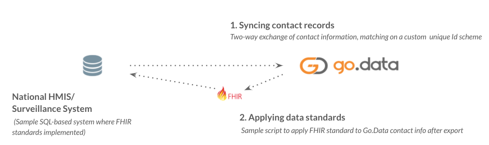
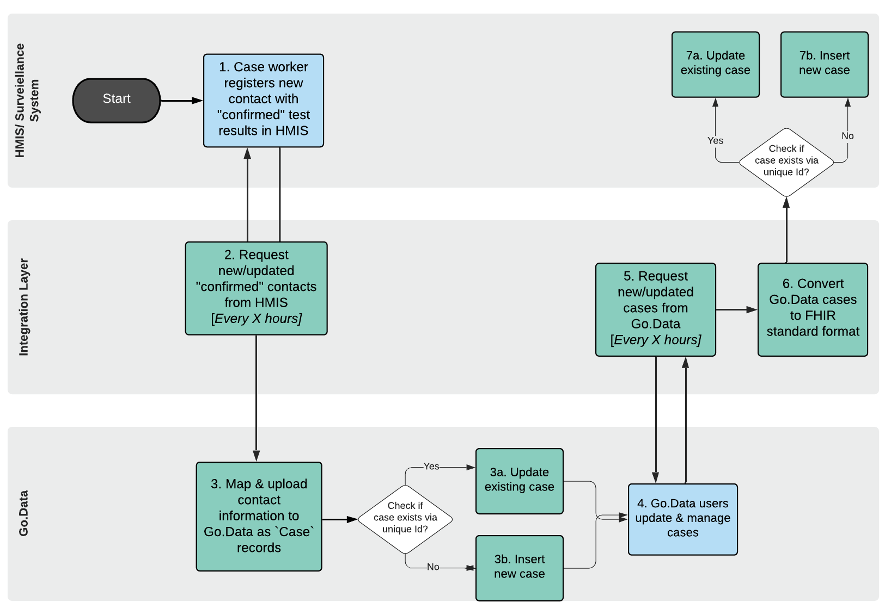
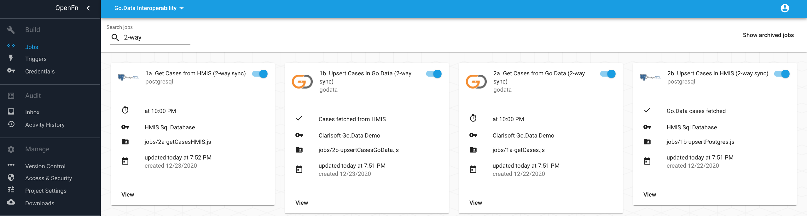
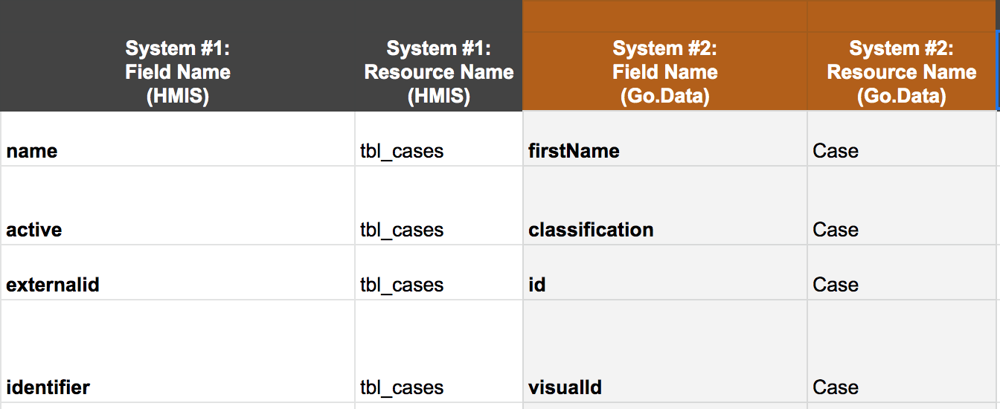
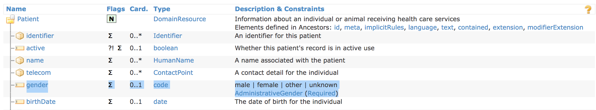

# Go.Data <> HMIS/Surveillance System Integration for 2-way Information Exchange
In most country-level implementations, Go.Data needs to interoperate with an existing HMIS or Surveillance system to ensure no duplication of efforts. These systems might be configured on an application like DHIS2 or are custom developed using other software or databases. In this solution we explore the following use cases by designing for a Go.Data integration with a theoretical SQL-based HMIS for 2-way exchange of case information. 



---
**Use Cases:**

**#1.**  _As a MOH employee, I would like to integrate contact data from my country’s surveillance system, so that I can use Go.Data for contact tracing & follow-up on reported cases in a way that does not duplicate efforts._

**#2.** _As a Go.Data user, I would like to automatically apply the FHIR data standard to any information collected via Go.Data before sharing with the HMIS to ensure data interoperability and to avoid any manual data cleaning/reformatting steps during information exchange._

---
## Solution Overview
See below visual for a data flow diagram for a two-way information exchange between Go.Data and a theoretical HMIS/surveillance system. For this reference, we integrated Go.Data with a sample "HMIS" database configured PostgreSQL to demonstrate how user might integrate with a SQL-based system. 



### Integration Scripts
See the Github repo for the raw source code for the following 4 OpenFn job scripts: 
1. **[`1a-getCasesHMIS.js`](https://github.com/WorldHealthOrganization/godata/blob/master/interoperability-jobs/1a-getCasesHMIS.js) gets active cases from HMIS Sql-based system.** Implements OpenFn API adaptor [`language-postgresql`](https://github.com/OpenFn/language-postgresql) function `sql(...)` to execute sql queries

2. **[`1b-upsertToGoData.js`](https://github.com/WorldHealthOrganization/godata/blob/master/interoperability-jobs/1b-upsertToGoData.js) upserts cases in Go.Data.**
Implements OpenFn API adaptor [`language-godata`](https://openfn.github.io/language-godata/index.html) function `upsertCases(...)` to (1) list Cases via a `GET` request filtering by `virtualId` (caseId), and then (2) sends a `POST` or `PUT` request to either insert or update case records depending on whether matching record found

3. **[`2a-getGoDataCases.js`](https://github.com/WorldHealthOrganization/godata/blob/master/interoperability-jobs/2a-getGoDataCases.js) gets Go.Data cases newly created/updated.** Implements OpenFn API adaptor [`language-godata`](https://openfn.github.io/language-godata/index.html) function `listCases(...)` to list Cases via a `GET` request. 

4.**[`2b-upsertToHMIS.js`](https://github.com/WorldHealthOrganization/godata/blob/master/interoperability-jobs/2b-upsertToHMIS.js) syncs Go.Data cases back to HMIS.** Implements OpenFn API adaptor [`language-postgresql`](https://github.com/OpenFn/language-postgresql) function `sql(...)` to execute sql queries. 

In OpenFn.org, we configured these jobs to run automatically on a cron timer to automate the two-way exchange. 


### Integration Approach
To automate data integration from the HMIS (or any external system) to Go.Data, implementers may consider **2 common integration approaches**: 
1. **Data forwarding** - in the source system there may be an option to configure some sort of data forwarding/publishing mechanism like a webhook or REST service. If available, this allows the source system to control what and when information is shared and can enable real-time data sharing. 
2. **Direct integration** where you can (1) send a request to fetch the relevant data from the source system, and then (2) upsert* the data in Go.Data via the API, matching HMIS `caseId` with Go.Data `externalId` to ensure no duplicate records are created. In the approach, the integration implementer can choose what information to fetch and how frequently (and is only limited by the API & user permissions). This approach does not support real-time integration, but data syncs can be scheduled regularly to ensure no lapse in data. Direct database integration was implemented for this reference implementation. 

Once the integration approach and requirements are determined, build a **HMIS-Go.Data Mapping Specification** to map the data elements between the 2 systems to identify corresponding variables and data transformation steps (e.g., reformatting dates, re-labeling values, mapping categories, etc.). [See example mapping specification](https://docs.google.com/spreadsheets/d/1SNx5wB818ikveaVhHqW9c4N05leL1WGZulsdC_BJj70/edit#gid=0). 


---
**NOTE:**

* _**"Upsert"** operations are a data import pattern where you first check if a record exists using an external identifier, and then either **update** or **insert** a new record dependng on whether an existing record is found. See the [section on Unique Identifiers](https://worldhealthorganization.github.io/godata/topics/1-unique-identifier-schemes) for additional considerations regarding upserts, `externalId` and other unique identifiers._ 

---

### Considerations for two-way syncing
1. Unique identifiers are critical to ensuring no duplicate records or efforts and developing a **shared record reference**. This should be one of your earliest considerations when considering a two-way data sync implementation. If there is no shared external identifier between the 2 systems, you may need to choose 1 from either system to log in both systems and use as the main record reference, or you may need to create a new identifier all together.  
2. Determine the system of record. In a two-way sync, one system should always be considered the master source of truth in case there are any data conflicts. The system of record will dictate which data values will be preserved/not overwritten in such circumstances. 
3. Consider implementing a date/time `cursor` so that every time you extract data from a source system, you will only extract the _most recent_ data. This minimizes the data load to be exchanged between systems, which is good for efficiency and data security. For example, only get `Cases` updated in the last 1 week vs. listing ALL cases in the Go.Data system. 
4. Consider what initiates the data `sync` between the two systems considering the two-way pattern and system of record to ensure no data gaps or overwrites. 
5. Leverage `upsert` operations wherever possible in data exchange flows to check for existing records and prevent duplicates (upsert = insert if new, update if record existing). 

## Use Case #1. HMIS to Go.Data flow
To demonstrate automated data integration between the HMIS database and Go.Data, we...
1. Configured OpenFn job [`1a-getCasesHMIS.js`](https://github.com/WorldHealthOrganization/godata/blob/master/interoperability-jobs/1a-getCasesHMIS.js) to fetch data from the HMIS system. Here we leveraged the open-sourve OpenFn adaptor [`language-postgresql`](https://github.com/OpenFn/language-postgresql) to connect directly with the database and execute a `sql()` statement to list relevant records. 
```
sql(state => 'SELECT * FROM tbl_cases WHERE active = true');
```
2. Configured a second OpenFn job [`1b-upsertToGoData.js`](https://github.com/WorldHealthOrganization/godata/blob/master/interoperability-jobs/1b-upsertToGoData.js) that then maps & loads the data from the HMIS to Go.Data, leveraging Go.Data API adaptor [language-godata](https://openfn.github.io/language-godata/). 

In this job script, we have implemented an `upsert` pattern leveraging `language-godata` to (1) search for existing `Cases` by sending a `GET` request to Go.Data filtering by the `visualId` external identifier (e.g., `CASE-100001`) to match, and then (2) create/update `Cases` (send a `POST`/`PUT` HTTP request) depending on whether the `Case` record already exists. 
```.js
upsertCase(
      '3b5554d7-2c19-41d0-b9af-475ad25a382b', // the outbreak ID
      'visualId', //external ID to upsert cases - this is the Case Mask ID -e.g., CASE-10001
      { data } //map HMIS variables to Go.Data
    )
```
See the docs on the Go.Data API adaptor `language-godata` helper function [`upsertCase(...)`](https://openfn.github.io/language-godata/global.html#upsertCase) for more on this upsert pattern and the `GET` and `POST`/`PUT` HTTP requests. 


##  Use Case #2. Go.Data to HMIS flow 
To automate data integration from Go.Data to the HMIS, we...
1. Configured OpenFn job [`2a-getGoDataCases.js`](https://github.com/WorldHealthOrganization/godata/blob/master/interoperability-jobs/2a-getGoDataCases.js) to automatically extract cases via an HTTP request to the Go.Data API to `GET /cases`. 
- We leveraged the adaptor `language-godata` helper function `listCases(...)`](https://openfn.github.io/language-godata/global.html#listCases).
- We apply a date `cursor` to filter the `GET` request made to `listCases` to ensure we only query `Cases` after a specified date. 
```.js
listCases('3b5554d7-2c19-41d0-b9af-475ad25a382b', {}, state => {
  function yesterdayDate() {
    const date = new Date();
    date.setDate(date.getDate() - 1);
    date.setHours(0, 0, 0, 0);
    return date.toISOString();
  }
  // We add a cursor so that we don't list ALL cases, but filter our search to only list NEW cases
  

  const yesterday = null; // set to null if we want to use manualCursor as a default date filter. Set to yesterDayDate() to use the date of yesterday.
  const manualCursor = '2020-07-24T00:00:00.000Z'; //default date filter for listing cases

  const cases = state.data
    .filter(report => {
      return report.dateOfReporting === (yesterday || manualCursor); //filter Cases by dateOfReporting = cursor date
    })
    .map(report => {
      return { //Here we map Go.Data variables from response to HMIS 
        name: `${report.firstName}, ${report.lastName || ''}`,
        status: report.classification,
        externalId: report.id,
        caseId: report.visualId,
        age: report.age ? report.age.years : report['age:years'],
        phone:
          report.addresses && report.addresses[0]
            ? report.addresses[0].phoneNumber
            : report['addresses:phoneNumber'],
        country:
          report.addresses && report.addresses[0]
            ? report.addresses[0].country
            : report['addresses:country'],
        location:
          report.addresses && report.addresses[0]
            ? report.addresses[0].locationId
            : report['addresses:locationId'],
      };
    });

  const HMISCases = state.data.filter(report => {
    return report.dateOfReporting === (yesterday || manualCursor);
  });

  console.log('Cases received...');
  console.log(cases);
  return { ...state, cases, HMISCases };
});
```
2.In the OpenFn job [`2b-upsertToHMIS.js`](https://github.com/WorldHealthOrganization/godata/blob/master/interoperability-jobs/2b-upsertToHMIS.js), we then upsert the transformed data in the HMIS system, checking the HMIS external `identifier` to ensure no duplicates are uploaded. 
```
upsertMany('tbl_cases', 'identifier', state => cases)(state);
```

Before upserting, we apply transformation rules determined from FHIR-HL7 to clean, re-format, & map the Go.Data information to match this international health information exchange standard. See the data cleaning & mapping performed within the [`alterState(...)`](https://github.com/WorldHealthOrganization/godata/blob/master/interoperability-jobs/2b-upsertToHMIS.js#L2) method according to the solution mapping specifications. 

Below is a screenshot of the ([FHIR Patient content standards](https://www.hl7.org/fhir/patient.html)) implemented in the HMIS database. We therefore need to map & transform Go.Data variables like `firstName`, `lastName`, `phoneNumber`, `birthYear` to align with the standard variables `name`, `telecome`, `birthDate`, etc. 




## Explore the Implementation
1. [See this video - TO UPDATE](https://drive.google.com/drive/folders/1Rf9TXCXkn8_XnjH4FcRsIGqDZ-UkVvdC) of the demo solution configured to demonstrate these use cases #1 and #2.  
2. HMIS demo: For this example use case, we configured a demo "HMIS" system on a SQL database and implemented OpenFn jobs that leverage the [`language-postgresql`](https://github.com/OpenFn/language-postgresql) to connect directly with the database. 
3. Integration: See [example integration scripts](https://github.com/WorldHealthOrganization/godata/tree/master/interoperability-jobs) implemented on the OpenFn integration platform for automated data exchange for scenarios `1` and `2`. Explore the solution at [OpenFn.org](https://www.openfn.org/login) using the login details: `godata@who.int`; pw: `interoperability`. 
4. Go.Data API Wrapper: See the open-source OpenFn API adaptor [`language-godata`](https://openfn.github.io/language-godata/)
5. See the solution [design documentation](https://drive.google.com/drive/folders/1qL3el6F2obdmtu2QKgcWYoXWsqBkhtII).
6. FHIR-HL7 Documentation on the content specifications for [Patient resources](https://www.hl7.org/fhir/patient.html). See the [Applying Data Standards](https://worldhealthorganization.github.io/godata/topics/applying-data-standards) section for more information. 
